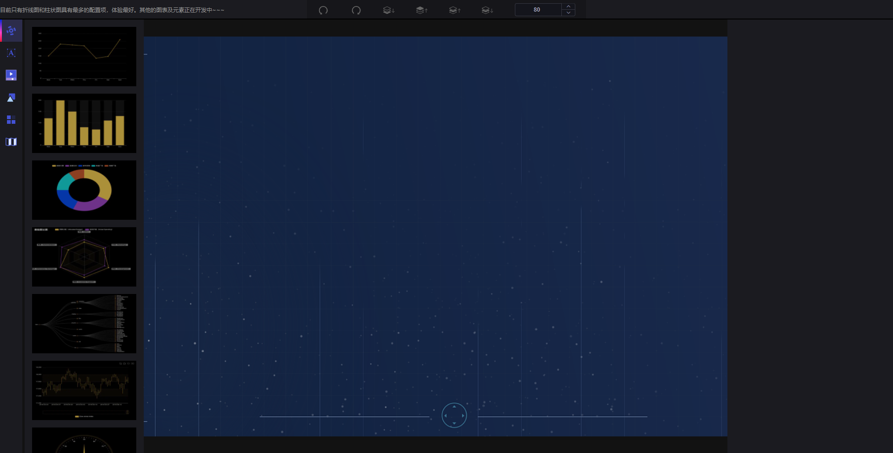
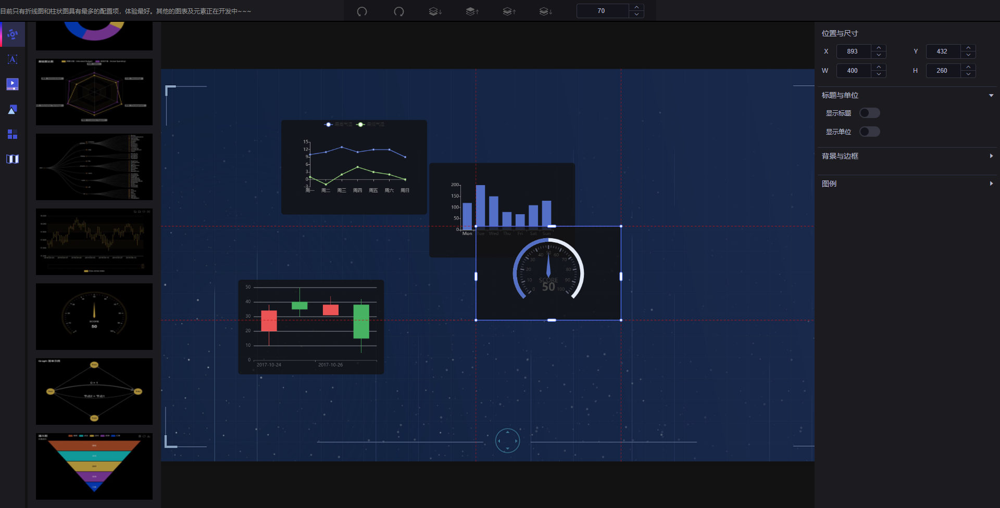
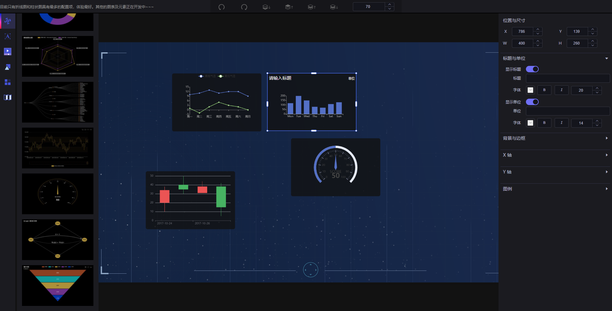
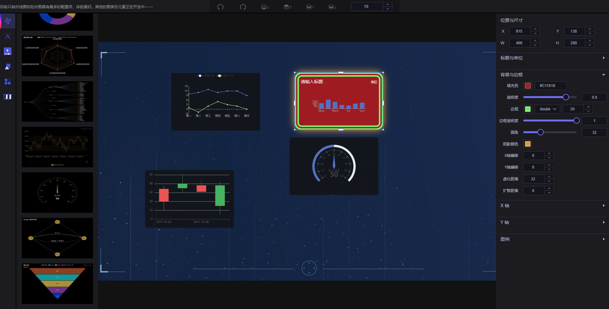
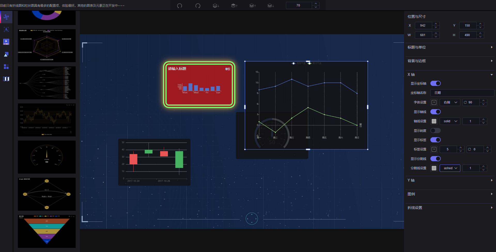

# Vue 3 Data Visualization

## 项目简介

<a href="https://github.com/miyuesc/vue-data-visualization" target="__blank"></a>
<a href="https://github.com/miyuesc/vue-data-visualization" target="__blank"></a>

<a href='https://gitee.com/miyuesc/vue-data-visualization'></a>
<a href='https://gitee.com/miyuesc/vue-data-visualization'></a>

本项目为个人项目, 主要使用 `Vue 3`, `Echarts 5`, `Element Plus` 进行开发. 使用原生 `JavaScript` 实现元素的拖拽与缩放.

该项目主要为实现通用的可视化大屏的简单配置, 对于特殊图表仍然需要二次开发.

项目预览: [https://miyuesc.github.io/data-visualization/](https://miyuesc.github.io/data-visualization/)

国内同步镜像: [https://miyuesc.gitee.io/data-visualization/](https://miyuesc.gitee.io/data-visualization/)

> 预览地址可能会存在版本不符的问题, 建议下载运行

## 主要功能

- [x] ECharts常用图表
- [x] 标题单位
- [x] 组件拖拽/缩放
- [x] 边框背景
- [x] 图表坐标轴配置
- [x] 图例设置
- [x] 画布整体缩放
- [x] 组件层级调整
- [x] 组件图层列表
- [ ] 常用形状组件
- [ ] 标题/文字组件
- [ ] 图表的不同设置
- [ ] 高德地图组件
- [ ] 常用列表/轮播/数字动画等组件
- [ ] 预览/导出json
- [ ] 数据源配置
- [ ] ...

## 使用

### 1. 下载或克隆该项目到本地

```shell
git clone https://github.com/miyuesc/vue-data-visualization.git -b main
```

### 2. 安装依赖

```shell
// yarn run install
npm run install
```

### 3. 运行预览

```shell
// yarn run build
npm run build
```

## 运行预览

### 1. 初始界面



### 2. 拖拽效果



### 3. 标题与单位配置



### 4. 背景边框配置



### 5. X轴/Y轴配置




## 友情赞助

偷偷丢个赞赏码吧~~~~

微信：[如果对您有帮助，您可以请我喝杯咖啡~~](https://images.weserv.nl/?url=https://i0.hdslb.com/bfs/article/fcf8ffa7f5a1dad34c3c9066e6b0f1d2a181c981.jpg)

支付宝：[如果对您有帮助，您可以请我喝杯咖啡~~](https://images.weserv.nl/?url=https://i0.hdslb.com/bfs/article/8236f07c5d73175acbed49937020ed05127d0de9.jpg)

## 学习交流

如果您觉得这些文章对您有帮助，想和我一起学习，欢迎您关注我的微信订阅号。

订阅号名称：前端小白MiyueFE

订阅号：[前端小白MiyueFE](https://images.weserv.nl/?url=https://i0.hdslb.com/bfs/article/fdef0d8f1731ed03b4123d22b7d82acacb6ca10c.jpg)
